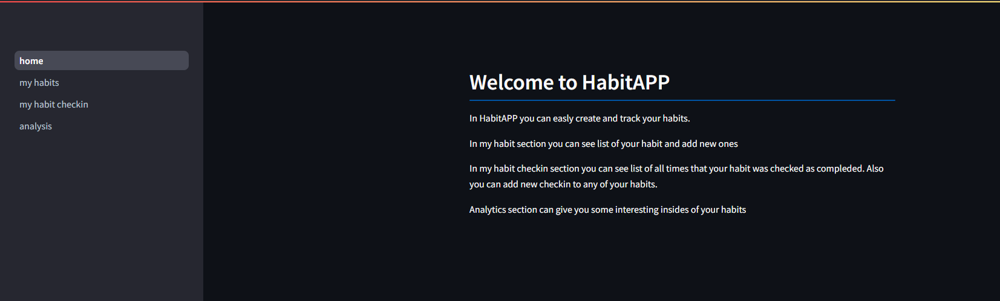
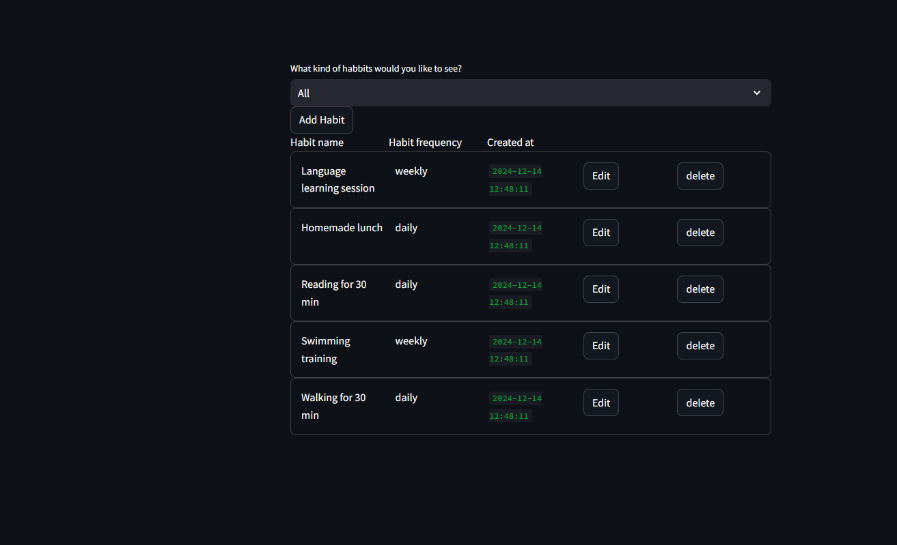
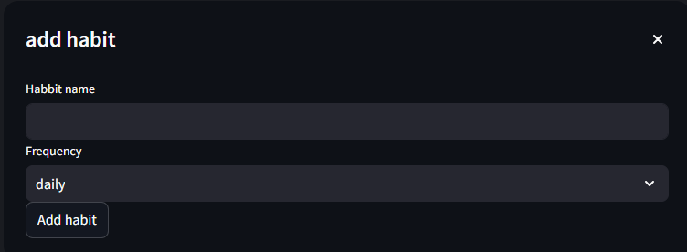
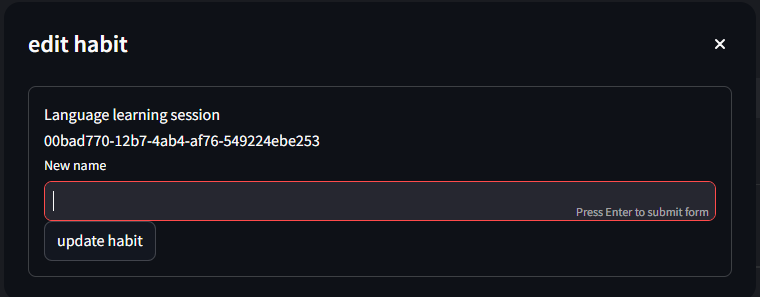
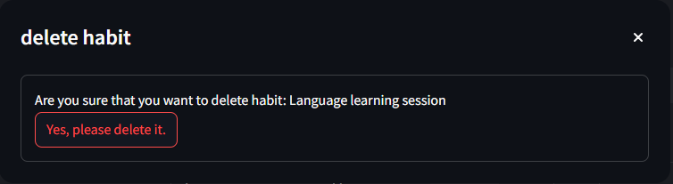
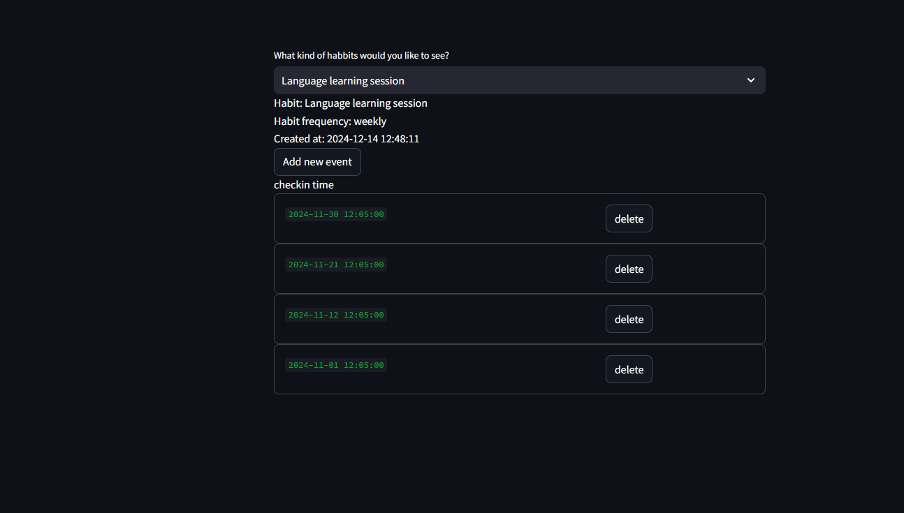
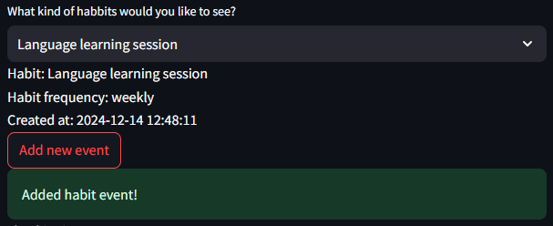
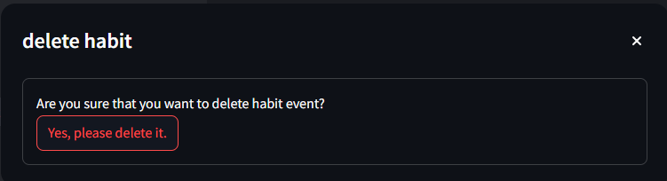
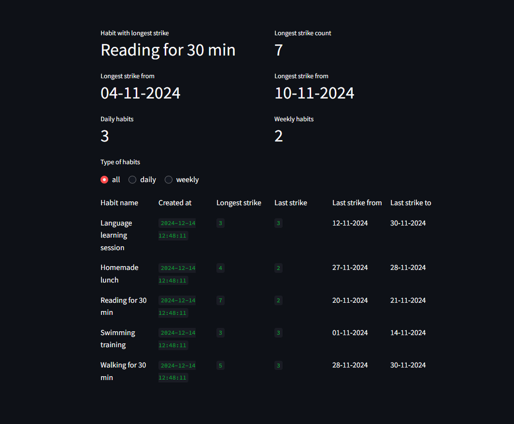

# Habit app
Habit app is a web based aplication that allows you to track your own habbits.


The application comes with the example dataset for 4 weeks. 
If you want to not load it - in file `docker-compose.yml` please uncoment line `30`.

This project can be runned localy - directly form the computer enviroment or by using Docker Compose.
Habit app have two components.
1) MySQL database that is in the form of the docker containers
2) Streamlit application that can be run as part of the user system or in docker containers

**IMPORTANT**

By default data is not presistent in the setup. If you want to save it on your disk as well in the file `docker-compose.yml` please uncomment lines `11` and `12`.

## Requirements
**Docker** - for building containers for the application

**Docker Compose** - for orchestrating services

**Make File** - for easy access to comands 

## Starting application

### Docker version (recommended)
In your terminal please use command

```
docker-compose -f docker-compose.yml up 
```
That will start the MySQL database and the streamlit app. After loading you can access aplication in your webbrowser under link http://localhost:8080

To stop application please use:
```
docker-compose -f docker-compose.yml down
```

### Local instalation
The application can be also run directly from the user computer enviroment, but what is recommented to use still python virtual enviroment. In the example belowe it is used the conda enviroment

Setup of the enviroment:
```
conda create -n habit_app PYTHON=3.10
conda activate habit_app
pip install -r requirements.txt
```
Starting Application:
```
## only if enviroment is not active already
conda activate habit_app 

make start_db
## OR
docker-compose -f docker-compose.yml up -d db

make run_web
## OR
streamlit run src/home.py --server.port 8080
```
Usage of Makefile depends on the user decision.

Stoping application:
```
## Stoping Streamlint app - ctrl + c

## Stoping DB
make stop_db
## OR
docker-compose -f docker-compose.yml down
```

## Application usage

### Home screen


Home screen have a small welcome message and allows to navigate to different section of the app

### My Habits

This section allows you to see details of the habits in the top slection box you can chose what kind of habits you want to see (all, daily, weekly).

#### Creating Habit
To add new habit you have to click on the button `Add habit`. The popup will show up:


Aftre filling in details and choosing the frequency of habit, click `Add habit` to save it in the database. 
Importnat is that name of the habit has to be unique. If habit with the same name already exists, you will be informed about it.

#### Editing Habit
After clicking on the edit button on the level of habit that is in intrest you will get a popup that allows the change of the name of habit.


#### Deleteing Habit
You can also click on the delete button for given habit. It will give you another popup with question: are you sure?


**Importnat**
Deletion of Habit will aslo delete **all** habit events associated with it!
### My habit checkin
This page allows you to see all habits checkins - the points in time where your habit was checked as done.



#### Adding habit checkin

Just click on the `Add new event` button and the checkin with the current time will be added to the list. **Important** only one checking per day per habit is allowed. If you try to add more - you will see proper comunicate about that on the screen.



#### deleting habit checkin

If you click on the `delete` button the given event will be removed form the lists. **After deletion you cannot bring the information back**. Thats why you will be asked if you are sure to do it.



### Analysis



Analysis section can give you overview on what is currently going on with your habits.

The top section allways will show you the habit with the longest strikie in the history with some details around it.
Also total number of the habits is shown.

After that you can use radio buttons to see `All`, `Daily` or `weekly` habits with details around strikes for each of them.

## Running Tests
Application came with the test that are checking the correctnes of the outcomes for functions build-into app. If you want to run them please follow steps below:

### Running in docker

Simply run commend:
```
docker-compose -f docker-compose.testing.yml up
```

After test run you can remove containers and test dadtabase by:
```
docker-compose -f docker-compose.testing.yml down
```

### Running localy

Prepare enviroment:
```
conda create -n habit_app_test PYTHON=3.10
conda activate habit_app_test
pip install -r requirements_dev.txt
```

Running tests
```
## Start test DB
docker-compose -f docker-compose.testing.yml up -d db_test
## OR
make start_test_db

coverage run -m --source=src pytest
coverage report -m
## OR
make test
```

To stop and remove test DB and its container:
```
docker-compose -f docker-compose.testing.yml down
```